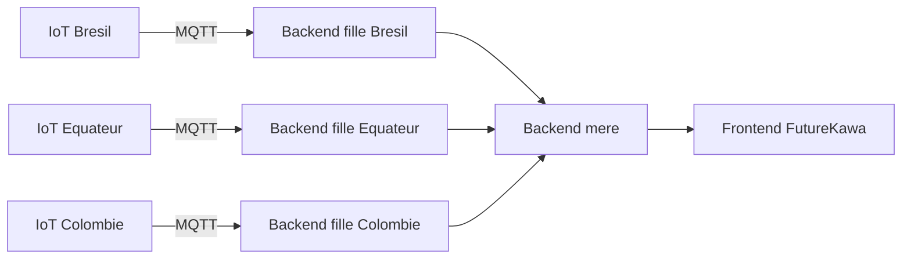

# FutureKawa CI/CD + Terraform

Monorepo de demonstration pour une architecture avec :

- 3 backends filles : Bresil, Equateur, Colombie
- 1 backend mere qui agrège les reponses des filles
- 1 frontend qui affiche la synthese
- Terraform pour provisionner les conteneurs Docker localement
- GitHub Actions pour la CI et le CD

## Architecture



## Fonctionnalites siege (backend central + frontend web)

La solution siege est composee de:

- un backend central qui interroge chaque backend pays et consolide:
    - l'etat des stocks (lots derives, statut stock)
    - les details metier lot (variete, process, score SCA, poids, qualite, quantite, DLC)
    - les expeditions (statut, client, poids total, tracking, quai de depart, composition des lots)
    - les mesures historiques temperature/humidite
    - les alertes (vigilance/critique)
- un frontend web de supervision qui permet:
    - la selection d'un pays/exploitation
    - l'affichage des lots tries par date de stockage
    - la consultation d'un lot (detail + mesures)
    - la visualisation de courbes temperature/humidite
    - la consultation des alertes et statuts

Cette base est utilisable en demonstration et extensible vers des donnees metier lot plus riches.

## Stack

- Java 21 + Spring Boot 3 (backend fille et backend mere)
- PostgreSQL 16 (une base dediee par backend fille)
- Angular 19 (frontend)
- Terraform
- Provider Docker pour Terraform
- GitHub Actions

## Strategie base de donnees

Choix retenu: meme schema SQL, mais une base dediee par pays.

- C'est le meilleur compromis pour ce projet: on garde un schema unique et on isole les donnees par pays.
- Chaque backend fille utilise son propre conteneur PostgreSQL (`postgres-brazil`, `postgres-ecuador`, `postgres-colombia`).
- Le script SQL commun est applique au demarrage de chaque base depuis `services/backend-child/Bdd/MSPR5_BDD-1778060454.sql`.

Avec cette approche, ajouter un nouveau pays via `var.children` cree automatiquement:

- un nouveau backend fille
- une nouvelle base PostgreSQL dediee

## Structure

- `services/backend-child` : service reutilisable pour chaque backend fille
- `services/backend-mother` : aggregation des filles
- `services/frontend` : interface web
- `terraform` : infrastructure locale Docker
- `.github/workflows` : CI/CD

## Prerequis

- Node.js 20+
- Docker Desktop
- Terraform 1.6+
- Optionnel local: Java 21 + Gradle et Node.js 20 si tu veux lancer hors Docker

## Adaptabilite du nombre de filles

Le backend mere ne hardcode plus 3 filles.
Il lit la variable d'environnement `CHILDREN_SERVICES` injectee par Terraform.

Terraform construit cette valeur automatiquement a partir de `var.children` dans [terraform/variables.tf](terraform/variables.tf).

Exemple: ajouter une 4e fille via un fichier `terraform.auto.tfvars` dans le dossier `terraform`:

```hcl
children = {
    brazil = {
        country       = "Brazil"
        external_port = 3101
    }
    ecuador = {
        country       = "Ecuador"
        external_port = 3102
    }
    colombia = {
        country       = "Colombia"
        external_port = 3103
    }
    peru = {
        country       = "Peru"
        external_port = 3104
    }
}
```

Tu peux aussi surcharger les credentials PostgreSQL via les variables Terraform:

```hcl
child_db_user     = "futurekawa"
child_db_password = "futurekawa_pwd"
```

Puis:

```powershell
cd terraform
terraform apply -auto-approve
```

La mere agregera automatiquement 4 filles sans changement de code.

## Run local avec Docker (recommande)

Demarrer l'infra :

```powershell
cd terraform
terraform init
terraform apply -auto-approve
```

Acces :

- Frontend Angular (Nginx) : http://localhost:8080
- Backend mere Spring Boot : http://localhost:3200/api/children
- Backend fille Bresil Spring Boot : http://localhost:3101/api/info
- Backend fille Equateur Spring Boot : http://localhost:3102/api/info
- Backend fille Colombie Spring Boot : http://localhost:3103/api/info

Endpoints utiles pour la demo siege:

- Backend mere consolide : http://localhost:3200/api/children
- Health backend mere : http://localhost:3200/health
- Health backend fille (exemple Bresil) : http://localhost:3101/health
- Historique capteurs fille (exemple Bresil) : http://localhost:3101/api/capteurs
- Derniere mesure capteur fille (exemple Bresil) : http://localhost:3101/api/capteurs/latest
- Lots fille (exemple Bresil) : http://localhost:3101/api/lots
- Expeditions fille (exemple Bresil) : http://localhost:3101/api/expeditions

Frontend demo:

- Mode Docker/Nginx: http://localhost:8080
- Mode dev Angular (hot reload): http://localhost:4300 via `./dev-start.ps1` (proxy `/api` activé vers le backend mère)
- Prometheus: http://localhost:9090
- Grafana: http://localhost:3001

Identifiants Grafana par défaut:

- utilisateur: `admin`
- mot de passe: `admin`

Grafana est pré-provisionné avec une source de données Prometheus. Tu peux y créer des dashboards et des règles d’alerting pour surveiller les métriques exposées par les backends via `/actuator/prometheus`.

Dans le dashboard web, les onglets **Stocks** et **Expéditions** proposent aussi désormais un CRUD complet côté frontend, avec tri et recherche par champ métier.

Un dashboard de base `FutureKawa Overview` est aussi provisionné automatiquement avec :

- CPU système
- mémoire heap
- threads actifs
- requêtes HTTP par seconde
- répartition des réponses HTTP
- latence HTTP max

Des règles d’alerte Grafana sont aussi provisionnées pour :

- CPU backend > 75%
- heap backend > 85%
- backend indisponible (`up = 0`)

Detruire l'infra :

```powershell
cd terraform
terraform destroy -auto-approve
```

## Run local hors Docker (optionnel)

- Backend fille: `cd services/backend-child ; gradle bootRun`
- Backend mere: `cd services/backend-mother ; gradle bootRun`
- Frontend Angular: `cd services/frontend ; npm install ; npm run start`

Note Windows: dans cet environnement, `npm` peut etre bloque en PowerShell. Utilise `npm.cmd`.
## CI/CD

### CI

La CI est desormais entierement geree par Jenkins.
Le workflow GitHub Actions CI (`.github/workflows/ci.yml`) a ete retire.

Deux variantes Jenkins sont disponibles:

- [Jenkinsfile](Jenkinsfile): pipeline Jenkins pour noeud Windows (commandes `bat`)
- [Jenkinsfile.docker](Jenkinsfile.docker): pipeline Jenkins avec agents Docker par stage pour limiter les dependances installees sur le noeud

Les deux pipelines executent:

- les tests Spring Boot (Gradle) sur `backend-child` et `backend-mother` en parallele
- les tests unitaires Angular frontend (Karma + Chrome Headless)
- le build Angular du frontend
- `terraform init -backend=false`, `terraform fmt -check` et `terraform validate`
- les builds Docker de `backend-child`, `backend-mother` et `frontend` en parallele

Prerequis selon la variante:

- [Jenkinsfile](Jenkinsfile): Java 21 + Gradle, Node.js 20 + npm, Terraform 1.6+, Docker
- [Jenkinsfile.docker](Jenkinsfile.docker): Docker + Jenkins Pipeline plugin Docker (les outils sont embarques dans les images de stage)

Guide de mise en place Jenkins (job, credentials, webhook): [JENKINS_SETUP.md](JENKINS_SETUP.md)

### CD

Le workflow `cd.yml` :

- se declenche sur `main` ou manuellement
- execute `terraform apply`
- est prevu pour un runner `self-hosted` avec Docker et Terraform

Ce choix donne un deploiement persistant sur une machine cible, contrairement a un runner GitHub heberge qui serait ephemere.

## Workflow equipe: feature -> pre-prod -> main

Objectif: chaque dev valide sa branche feature en local avec un environnement pre-prod reproductible, puis passe par `pre-prod` avant `main`.

### 1. Travailler sur une branche feature

```powershell
git checkout pre-prod
git pull origin pre-prod
git checkout -b feature/ma-modif
```

### 2. Lancer la pre-prod locale sur la branche feature

```powershell
docker compose -f docker-compose.preprod.yml up -d --build
```

### 3. Smoke tests minimum

Front ouvre:

```powershell
Invoke-WebRequest -Uri "http://localhost:8080" -UseBasicParsing | Select-Object -ExpandProperty StatusCode
```

API mere repond:

```powershell
Invoke-WebRequest -Uri "http://localhost:3200/api/children" -UseBasicParsing | Select-Object -ExpandProperty StatusCode
```

Les pays sont `available=true`:

```powershell
$r = Invoke-WebRequest -Uri "http://localhost:3200/api/children" -UseBasicParsing
$j = $r.Content | ConvertFrom-Json
$j.children | ForEach-Object { "{0}: available={1}, lots={2}, expeditions={3}" -f $_.name, $_.available, ($_.lots | Measure-Object | Select-Object -ExpandProperty Count), ($_.expeditions | Measure-Object | Select-Object -ExpandProperty Count) }
```

Alternative recommandee (script unique):

```powershell
./scripts/smoke-preprod.ps1
```

Le script execute ces tests et retourne un code d'erreur si un test echoue:

- Frontend HTTP: `GET /` sur le frontend doit renvoyer HTTP 200
- Mother API HTTP: `GET /api/children` doit renvoyer HTTP 200
- Mother API JSON: la reponse doit etre un JSON valide
- Children list present: la cle `children` doit exister et contenir au moins un element
- Children availability: tous les enfants doivent etre `available=true`
- Children data completeness: chaque enfant doit avoir `lots > 0` et `expeditions > 0`
- Child direct health: tous les endpoints `/health` des backends pays doivent renvoyer HTTP 200

Exemple contre la prod (URLs explicites):

```powershell
./scripts/smoke-preprod.ps1 `
    -FrontendUrl "http://34.156.12.77" `
    -MotherApiUrl "http://34.156.12.77:3200/api/children" `
    -ChildHealthUrls "http://35.205.81.113:3000/health","http://34.62.99.9:3000/health","http://34.52.149.208:3000/health"
```

Arreter la stack locale:

```powershell
docker compose -f docker-compose.preprod.yml down
```

### 4. Merge feature -> pre-prod

```powershell
git add .
git commit -m "feat: ..."
git push -u origin feature/ma-modif
```

Puis ouvrir une PR `feature/ma-modif` vers `pre-prod`.

### 5. Merge pre-prod -> main

Apres validation CI/CD sur `pre-prod`, ouvrir une PR `pre-prod` vers `main` pour le deploiement prod.
