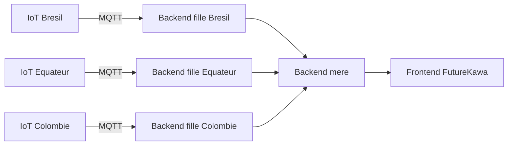

# FutureKawa CI/CD + Terraform

Monorepo de demonstration pour une architecture avec :

- 3 backends filles : Bresil, Equateur, Colombie
- 1 backend mere qui agrège les reponses des filles
- 1 frontend qui affiche la synthese
- Terraform pour provisionner les conteneurs Docker localement
- GitHub Actions pour la CI et le CD

## Architecture



## Stack

- Java 21 + Spring Boot 3 (backend fille et backend mere)
- PostgreSQL 16 (une base dediee par backend fille)
- Angular 19 (frontend)
- Terraform
- Provider Docker pour Terraform
- GitHub Actions

## Strategie base de donnees

Choix retenu: meme schema SQL, mais une base dediee par pays.

- C'est le meilleur compromis pour ce projet: on garde un schema unique et on isole les donnees par pays.
- Chaque backend fille utilise son propre conteneur PostgreSQL (`postgres-brazil`, `postgres-ecuador`, `postgres-colombia`).
- Le script SQL commun est applique au demarrage de chaque base depuis `services/backend-child/Bdd/MSPR5_BDD-1778060454.sql`.

Avec cette approche, ajouter un nouveau pays via `var.children` cree automatiquement:

- un nouveau backend fille
- une nouvelle base PostgreSQL dediee

## Structure

- `services/backend-child` : service reutilisable pour chaque backend fille
- `services/backend-mother` : aggregation des filles
- `services/frontend` : interface web
- `terraform` : infrastructure locale Docker
- `.github/workflows` : CI/CD

## Prerequis

- Node.js 20+
- Docker Desktop
- Terraform 1.6+
- Optionnel local: Java 21 + Gradle et Node.js 20 si tu veux lancer hors Docker

## Adaptabilite du nombre de filles

Le backend mere ne hardcode plus 3 filles.
Il lit la variable d'environnement `CHILDREN_SERVICES` injectee par Terraform.

Terraform construit cette valeur automatiquement a partir de `var.children` dans [terraform/variables.tf](terraform/variables.tf).

Exemple: ajouter une 4e fille via un fichier `terraform.auto.tfvars` dans le dossier `terraform`:

```hcl
children = {
    brazil = {
        country       = "Brazil"
        external_port = 3101
    }
    ecuador = {
        country       = "Ecuador"
        external_port = 3102
    }
    colombia = {
        country       = "Colombia"
        external_port = 3103
    }
    peru = {
        country       = "Peru"
        external_port = 3104
    }
}
```

Tu peux aussi surcharger les credentials PostgreSQL via les variables Terraform:

```hcl
child_db_user     = "futurekawa"
child_db_password = "futurekawa_pwd"
```

Puis:

```powershell
cd terraform
terraform apply -auto-approve
```

La mere agregera automatiquement 4 filles sans changement de code.

## Run local avec Docker (recommande)

Demarrer l'infra :

```powershell
cd terraform
terraform init
terraform apply -auto-approve
```

Acces :

- Frontend Angular (Nginx) : http://localhost:8080
- Backend mere Spring Boot : http://localhost:3200/api/children
- Backend fille Bresil Spring Boot : http://localhost:3101/api/info
- Backend fille Equateur Spring Boot : http://localhost:3102/api/info
- Backend fille Colombie Spring Boot : http://localhost:3103/api/info

Detruire l'infra :

```powershell
cd terraform
terraform destroy -auto-approve
```

## Run local hors Docker (optionnel)

- Backend fille: `cd services/backend-child ; gradle bootRun`
- Backend mere: `cd services/backend-mother ; gradle bootRun`
- Frontend Angular: `cd services/frontend ; npm install ; npm run start`

Note Windows: dans cet environnement, `npm` peut etre bloque en PowerShell. Utilise `npm.cmd`.
## CI/CD

### CI

La CI est desormais entierement geree par Jenkins.
Le workflow GitHub Actions CI (`.github/workflows/ci.yml`) a ete retire.

Deux variantes Jenkins sont disponibles:

- [Jenkinsfile](Jenkinsfile): pipeline Jenkins pour noeud Windows (commandes `bat`)
- [Jenkinsfile.docker](Jenkinsfile.docker): pipeline Jenkins avec agents Docker par stage pour limiter les dependances installees sur le noeud

Les deux pipelines executent:

- les tests Spring Boot (Gradle) sur `backend-child` et `backend-mother` en parallele
- les tests unitaires Angular frontend (Karma + Chrome Headless)
- le build Angular du frontend
- `terraform init -backend=false`, `terraform fmt -check` et `terraform validate`
- les builds Docker de `backend-child`, `backend-mother` et `frontend` en parallele

Prerequis selon la variante:

- [Jenkinsfile](Jenkinsfile): Java 21 + Gradle, Node.js 20 + npm, Terraform 1.6+, Docker
- [Jenkinsfile.docker](Jenkinsfile.docker): Docker + Jenkins Pipeline plugin Docker (les outils sont embarques dans les images de stage)

Guide de mise en place Jenkins (job, credentials, webhook): [JENKINS_SETUP.md](JENKINS_SETUP.md)

### CD

Le workflow `cd.yml` :

- se declenche sur `main` ou manuellement
- execute `terraform apply`
- est prevu pour un runner `self-hosted` avec Docker et Terraform

Ce choix donne un deploiement persistant sur une machine cible, contrairement a un runner GitHub heberge qui serait ephemere.
